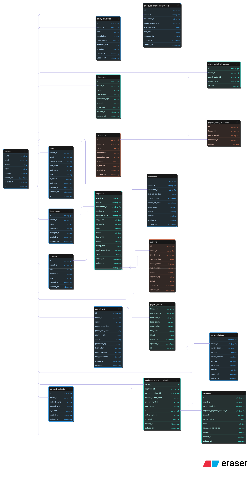

Multi-Tenant Payroll System README


# Multi-Tenant AI Payroll System

A comprehensive, production-ready payroll management platform built with **Spring Boot 3.5.8** and **Java 21**, designed for multi-tenant SaaS deployments with AI-powered insights and compliance automation.

## 🎯 Overview

The Multi-Tenant AI Payroll System is an enterprise-grade solution for managing payroll operations across multiple organizations. It implements **shared-schema multi-tenancy**, automated payroll calculations, role-based access control, and Google Generative AI integration for intelligent payroll analytics and insights.

**Key Highlights:**


---

## 📋 Table of Contents

1. [Tech Stack](#tech-stack)
2. [Architecture](#architecture)
3. [Database Schema](#database-schema)
4. [Getting Started](#getting-started)
5. [Configuration](#configuration)
6. [API Endpoints](#api-endpoints)
7. [Multi-Tenancy](#multi-tenancy)
8. [Security](#security)
9. [AI Features](#ai-features)
10. [Development Workflow](#development-workflow)
11. [Testing](#testing)
12. [Deployment](#deployment)
13. [Troubleshooting](#troubleshooting)

---

## 🛠️ Tech Stack

### Core Framework
| Component | Technology | Version |
|-----------|-----------|---------|
| **Java** | OpenJDK | 21+ |
| **Framework** | Spring Boot | 3.5.8 |
| **Build Tool** | Maven | 3.9+ |

### Key Dependencies

**Backend:**
- `spring-boot-starter-web` – REST API framework
- `spring-boot-starter-data-jpa` – ORM with Hibernate
- `spring-boot-starter-validation` – Bean validation
- `spring-boot-starter-oauth2-resource-server` – OAuth2 authentication
- `spring-boot-starter-actuator` – Health checks & metrics
- `spring-boot-starter-data-redis` – Caching layer & JWT Session manager
- `spring-ai-starter-model-google-genai` – Google Generative AI integration
- `lombok` – Reduce boilerplate code

**Database:**
- `org.postgresql:postgresql` – PostgreSQL driver
- `spring-boot-docker-compose` – Auto-start PostgreSQL + Redis via Docker

**Observability:**
- `micrometer-registry-prometheus` – Prometheus metrics export

**Testing:**
- `spring-boot-starter-test` – JUnit 5, Mockito
- `testcontainers` – PostgreSQL & Redis containers for integration tests
- `spring-boot-testcontainers` – Seamless TestContainers integration

---

## 🏗️ Architecture

### System Design


### Layered Architecture

Controller Layer (REST endpoints)
↓
Service Layer (Business logic, transactions, AI calls)
↓
Repository Layer (Database queries, JPA)
↓
Entity Layer (JPA models with @Entity, @Table)
↓
Database (PostgreSQL with tenant_id on all tables)

### Multi-Tenancy Pattern

**Shared Schema, Separate Data:**
- Single PostgreSQL database shared by all tenants
- Every table has `tenant_id` column (non-nullable, indexed)
- Row-level security: all queries filter by `tenant_id`
- No cross-tenant data leakage by design

---

## 📊 Database Schema

### Base Model
All entities extend `BaseModel` which provides common fields:
- `id`: Unique identifier (UUID)
- `createdAt`: Timestamp of creation
- `updatedAt`: Timestamp of last update
- `createdBy`: User who created the record
- `updatedBy`: User who last updated the record

### Standardized Response Format
All API responses follow the `Result<T>` pattern:
```java
public record Result<T>(
    boolean flag,
    String message,
    T data
) {
    public static <T> ResponseEntity<Result<T>> success(String message, T data) {
        return new ResponseEntity<>(new Result<>(true, message, data), HttpStatus.OK);
    }
    
    // All other implementations...
}
```

### Tenant Entity
```java
@Entity
@Table(name = "tenants")
public class Tenant extends BaseModel {
    @Column(nullable = false, unique = true)
    private String name;
    
    @Column(unique = true)
    private String subdomain;
    
    @Column(name = "is_active")
    private boolean active = true;
    
    // Getters, setters, and additional fields
}
```

### Entity Relationships
- All entities must extend `BaseModel` for auditing
- Use `@CreatedBy` and `@LastModifiedBy` for user tracking
- Foreign keys should include `tenant_id` for multi-tenancy

### Core Entities (15 Tables)

**Tenant Management:**
- `tenants` – Organization profiles (company name, email, status)
- `users` – User accounts with roles (admin, hr_officer, payroll_officer, employee)

**Organization Structure:**
- `departments` – Business units (marketing, engineering, etc.)
- `positions` – Job roles (senior engineer, junior manager)
- `employees` – Employee master records with employment details

**Salary Configuration:**
- `salary_structures` – Base salary templates
- `employee_salary_assignments` – Employee-to-salary mappings (salary history)
- `allowances` – Bonuses, HRA, shift allowance, etc.
- `deductions` – Tax, insurance, loan recovery, etc.

**Payroll Processing:**
- `payroll_runs` – Monthly/bi-weekly payroll batches
- `payroll_details` – Per-employee calculated payroll
- `payroll_detail_allowances` – Join table: allowance amounts per payroll
- `payroll_detail_deductions` – Join table: deduction amounts per payroll

**Time Tracking:**
- `attendance` – Daily check-in/check-out records
- `overtime` – Overtime hours with multipliers

**Payments & Tax:**
- `tax_calculations` – Income tax, professional tax per payroll
- `payment_methods` – Bank transfer, cash, cheque
- `employee_payment_methods` – Employee bank account details
- `payments` – Salary transfer records with status

See **ERD** (Eraser.io format) for visual schema.

---

## 🚀 Getting Started

### Prerequisites

- **Java 21+** – [Download](https://adoptopenjdk.net/)
- **Maven 3.9+** – [Download](https://maven.apache.org/download.cgi)
- **Docker & Docker Compose** – [Download](https://www.docker.com/products/docker-desktop)
- **Git** – Version control

### Installation

#### 1. Clone Repository

git clone https://github.com/DroidZeroCodes/multi-tenant-ai-payroll-system.git
cd multi-tenant-ai-payroll-system

#### 2. Start Docker Compose Stack

The project includes `docker-compose.yml` for PostgreSQL and Redis auto-startup:

./mvnw spring-boot:run

This automatically starts:
- **PostgreSQL** on `localhost:5432` (database: `payroll-system-db`)
- **Redis** on `localhost:6379` (caching layer)

Or manually:

docker-compose up -d

#### 3. Build Project

./mvnw clean install

#### 4. Run Application

./mvnw spring-boot:run

Or via JAR:

java -jar target/multi-tenant-ai-payroll-system-0.0.1-SNAPSHOT.jar

#### 5. Verify Health

curl http://localhost:8080/actuator/health

Expected response:

{
"status": "UP",
"components": {
"db": { "status": "UP" },
"redis": { "status": "UP" }
}
}

---

## ⚙️ Configuration

### Environment Variables

Create `.env` file or set in `application.yml`
- Development Environment: `application-dev.yml`
- Production Environment: `application-prod.yml`

### Database Configuration
Define the following environmental variables:
- SPRING_DATASOURCE_USERNAME
- SPRING_DATASOURCE_PASSWORD
- SPRING_DATASOURCE_DB

### Google Generative AI Configuration
Define the following environmental variables:
- ${GOOGLE_GENAI_API_KEY}

### Monitoring
The following endpoints have been exposed (add more as you see fit):
- health
- metrics
- prometheus

## 🔌 API Endpoints

### Authentication
- POST /api/auth/token

### Tenant Management

- POST   /api/tenants                    # Create tenant 
- GET    /api/tenants/:id                # Get tenant 
- PUT    /api/tenants/:id                # Update tenant 
- GET    /api/tenants                    # List tenants (admin only)
- DELETE /api/tenants/:id                # Deactivate tenant

### Employee Management

- POST   /api/tenants/:tenantId/employees          # Add employee 
- GET    /api/tenants/:tenantId/employees/:id      # Get employee 
- PUT    /api/tenants/:tenantId/employees/:id      # Update employee 
- GET    /api/tenants/:tenantId/employees          # List employees (paginated)
- DELETE /api/tenants/:tenantId/employees/:id      # Soft delete

### Payroll Processing

- POST   /api/tenants/:tenantId/payroll-runs       # Create payroll run 
- GET    /api/tenants/:tenantId/payroll-runs/:id   # Get payroll details 
- PUT    /api/tenants/:tenantId/payroll-runs/:id/approve   # Approve payroll 
- GET    /api/tenants/:tenantId/payroll-runs       # List payroll runs 
- POST   /api/tenants/:tenantId/payroll-runs/:id/calculate # Calculate payroll

### Payments

- POST   /api/tenants/:tenantId/payments           # Initiate payment 
- GET    /api/tenants/:tenantId/payments/:id       # Get payment status 
- GET    /api/tenants/:tenantId/payments           # List payments (filterable)

### Reports

- GET    /api/tenants/:tenantId/reports/payroll-summary   # Payroll summary 
- GET    /api/tenants/:tenantId/reports/pay-stub/:empId   # Employee pay stub 
- GET    /api/tenants/:tenantId/reports/attendance        # Attendance report

### AI Insights (New)

- POST   /api/tenants/:tenantId/ai/insights/payroll-anomalies 
- Request: { "payrollRunId": "...", "threshold": 0.85 } 
- Response: [{ "employeeId": "...", "anomaly": "high deduction", "confidence": 0.92 }]

- POST   /api/tenants/:tenantId/ai/recommendations/optimization
- Get AI-powered payroll optimization suggestions

---

## 🔐 Security

### Authentication & Authorization

**Role-Based Access Control (RBAC):**
| Role | Permissions |
|------|-------------|
| **admin** | Full system access, user management, payroll approval |
| **hr_officer** | Employee data, attendance, department management |
| **payroll_officer** | Salary structures, payroll calculations, payment initiation |
| **employee** | View own pay stubs, attendance, profile |

### Password Security

- Passwords hashed with **bcrypt** (Spring Security)
- Min. 12 characters, mixed case + numbers + symbols enforced
- Reset tokens expire in 24 hours
- Failed login attempts logged and rate-limited

### Data Encryption


---

## 🤖 AI Features

### Google Generative AI Integration

**Payroll Anomaly Detection:**
- Identifies unusual salary structures, deductions, or payment patterns
- Confidence scoring: anomalies ranked by severity
- Supports explainability ("Why flagged?")

**Payroll Optimization:**
- Recommends tax optimization strategies
- Suggests overtime reduction opportunities
- Analyzes allowance allocations

---

## 💻 Development Workflow

### Project Structure


### Running Locally

**Development Mode (with hot-reload):**

./mvnw spring-boot:run -Dspring-boot.run.arguments="--spring.profiles.active=dev"

**Debug Mode (attach debugger on port 5005):**

./mvnw spring-boot:run -Dspring-boot.run.jvmArguments="-agentlib:jdwp=transport=dt_socket,server=y,suspend=y,address=5005"

**With Live Database:**

docker-compose up -d postgres redis
./mvnw spring-boot:run

---

## 🧪 Testing

### Test Structure

**Unit Tests (Service Layer):**

@ExtendWith(MockitoExtension.class)
class PayrollServiceTest {
@Mock private EmployeeRepository employeeRepository;
@InjectMocks private PayrollService payrollService;

    @Test
    void testCalculatePayroll_Success() {
        // Arrange
        Employee emp = new Employee(/* ... */);
        when(employeeRepository.findById(any())).thenReturn(Optional.of(emp));
        
        // Act
        PayrollDetail detail = payrollService.calculatePayroll(emp.getId());
        
        // Assert
        assertNotNull(detail);
        assertEquals(BigDecimal.valueOf(50000), detail.getGrossSalary());
    }
}

**Integration Tests (with TestContainers):**

@SpringBootTest
@Testcontainers
class PayrollIntegrationTest {
@Container
static PostgreSQLContainer<?> postgres = new PostgreSQLContainer<>("postgres:15");

    @Test
    void testPayrollRun_E2E() {
        // Full payroll cycle test with real DB
    }
}

**Run Tests:**

./mvnw test                          # All tests
./mvnw test -Dtest=PayrollServiceTest  # Single test class
./mvnw verify                        # With coverage

---

## 🚀 Deployment

### Docker Build

FROM eclipse-temurin:21-jre-alpine
COPY target/multi-tenant-ai-payroll-system-0.0.1-SNAPSHOT.jar app.jar
ENTRYPOINT ["java", "-jar", "app.jar"]

**Build & Push:**

docker build -t your-registry/payroll-system:1.0.0 .
docker push your-registry/payroll-system:1.0.0

## 🐛 Troubleshooting

### Issue: PostgreSQL Connection Failed

**Error:** `org.postgresql.util.PSQLException: Connection refused`

**Solution:**
docker-compose up -d postgres
Or check if port 5432 is already in use
lsof -i :5432

### Issue: Redis Connection Timeout

**Error:** `io.lettuce.core.RedisConnectionException`

**Solution:**
docker-compose up -d redis
redis-cli ping  # Should return PONG

### Issue: OAuth2 Token Invalid

**Error:** `Jwt expired`

**Solution:**
- Ensure JWT issuer URI is correctly configured
- Check clock skew (time sync between servers)
- Refresh token if expired

### Issue: Out of Memory on Large Payroll Runs

**Error:** `java.lang.OutOfMemoryError: Java heap space`

**Solution:**
./mvnw spring-boot:run -Dspring-boot.run.jvmArguments="-Xmx2g -Xms1g"

---

## 📚 Additional Resources

- **Spring Boot Docs:** https://spring.io/projects/spring-boot
- **Spring Data JPA:** https://spring.io/projects/spring-data-jpa
- **OAuth2 & Spring Security:** https://spring.io/guides/gs/securing-web/
- **Spring AI (Google GenAI):** https://docs.spring.io/spring-ai/reference/
- **PostgreSQL JSONB:** https://www.postgresql.org/docs/current/datatype-json.html
- **Redis Caching:** https://redis.io/docs/
- **User Stories:** [User Stories.pdf](docs/User%20Stories.pdf)
- **ERD:** 

---

## 📞 Support

For issues, questions, or suggestions:
- **GitHub Issues:** [Report Bug](https://github.com/DroidZeroCodes/multi-tenant-ai-payroll-system/issues)
---

**Last Updated:** December 2025  
**Maintainer:** [@DroidZeroCodes](https://github.com/DroidZeroCodes)